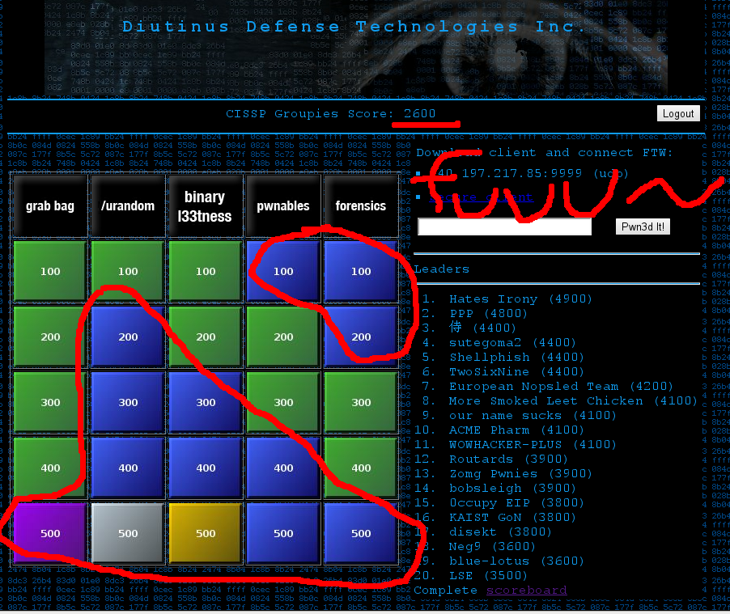
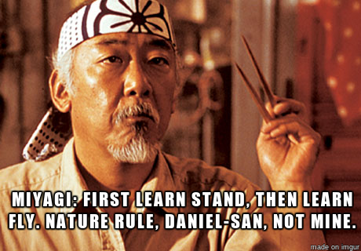
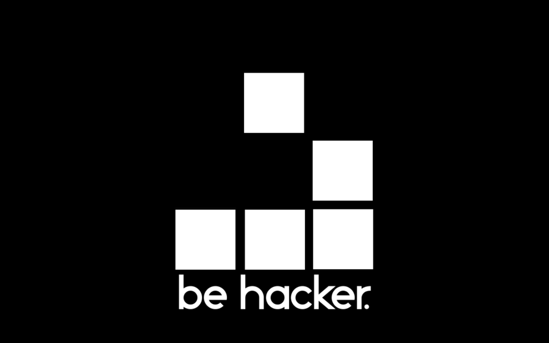

whatis MontréHack
=================
// Author: Olivier Bilodeau
:copyright: CC0 unless specified otherwise
:backend: slidy
:max-width: 45em
// unfortunately the following doesn't work
//:stylesheet: {docdir}/styles/montrehack.css
// the following will inline images in HTML (causing significantly larger
// filesizes)
:icons:
:data-uri:

== Intro

* Why: Be better at hacking games
* so-called CTF (Capture the Flag)

// plug the groupies

== We suck at CTF

// made by myself from my own screenshot

Well, 1st Canadian team often so maybe not that much

but still...

== Wisdom

// http://imgur.com/uvhTOsm
// http://bryaneisenberg.com/wp-content/uploads/2012/10/Karate-Kid-Miyagi.jpeg

and so we decided to start training together

== man montrehack

* Every 3rd Monday of the month
* @notman 6pm - 9pm + benelux after
* Someone proposes a challenge
* We get excited

== montrehack --help

* We show up with a laptop
* We hack in small ad-hoc teams
* We get the answer at the end
* We discuss
* `#include geekness.h`

== montrehack --version

* 8 editions so far
* Covering: Crypto, Unix exploitation, iOS forensics, networking, Web, some more crypto and binary
* We are not better at CTF yet :(

== How we run this

* Very little organisation
* Mostly on mailing lists: montrehack and now montrehack-meta
* We harass people to submit stuff

== $you: we need your help!

* Consider presenting a challenge
  https://github.com/montrehack/montrehack.github.com/wiki/Present-at-Montrehack
* Help manage our communities
* Subscribe on montrehack-meta and offer help
* TODO: logistics, planning, promo, logo, better organise content, etc.

== Next month

Silkstreet

* Challenge category: Exploitation
* Présenté a CSAW13 Finals
* challenge d'exploitation classique mais dans un binaire x86

== Stay in touch

* RO: http://montrehack.ca/
* RO: @montrehack on twitter
* RW: Google groups: montrehack, montrehack-meta
* montrehack on facebook, linkedin
* montrehack community on G+

== Questions?

// http://ardactn.deviantart.com/art/be-hacker-v2-160393971

